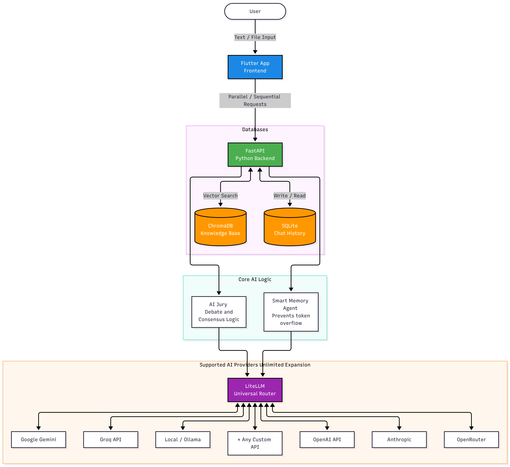

# ScanWeb AI Browser 🚀

A Premium AI Multi-Browser built with Flutter and Python. Add unlimited AI models (Cloud & Local) and chat with them simultaneously. This platform features an Autonomous AI Jury for solving complex tasks through debate, parallel processing capabilities, and local ChromaDB memory isolated per project.

## 🏗️ System Architecture

## ✨ Core Features

*   **Multi-Model Parallel Chat:** Connect and interact with multiple AI providers simultaneously. The backend utilizes the LiteLLM Universal Router to support Google Gemini, Groq API, Local Ollama, OpenAI, Anthropic, OpenRouter, and custom APIs.
*   **Autonomous AI Jury:** Enable debate mode where multiple AI models analyze solutions, detect errors, and debate each other to reach a flawless consensus on complex coding or logical problems.
*   **Smart Memory Agent:** Automatically manages token limits. If a conversation gets too long, this agent dynamically summarizes older context while strictly preserving critical technical details, code blocks, and logic.
*   **Local Knowledge Base:** Integrated ChromaDB vector search allows you to upload and memorize documents. The knowledge is isolated per chat session for maximum privacy and relevance.
*   **Persistent Chat History:** A fast, lightweight SQLite database handles the storage of all conversation histories locally.
*   **Cross-Platform Design:** A highly responsive and modern frontend built entirely in Flutter, ensuring a seamless experience across desktop environments.

## 🛠️ Technology Stack

**Frontend:**
*   Flutter / Dart

**Backend:**
*   Python 3.11
*   FastAPI & Uvicorn
*   LiteLLM (Universal API Routing)
*   ChromaDB (Vector Database)
*   SQLite (Relational Database)

## ⚙️ Automated Builds

This project utilizes GitHub Actions for continuous integration. Standalone executables for Windows and Linux environments are automatically built and packaged on every major release, requiring no local backend configuration for end-users.

---
**Powered by BOSNIA.BOY & scanweb.net**
